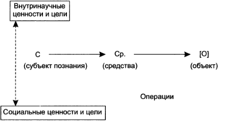
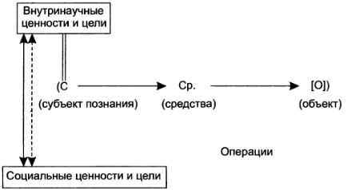

= Исторические типы научной рациональности

Наука проходит в своём развитии три этапа: классический, неклассический и постнеклассический cite:[kohanovskiy]. Каждому этапу развития науки соответствует тип научной рациональности cite:[ogordnikov].

== Классическая наука

_Классический тип научной рациональности_ (17-19 века) акцентирует внимание на объекте, пренебрегая при этом всем, что относится к субъекту и средствам его деятельности. Такое устранение рассматривается как необходимое условие получения объективного знаний.

Фридрих Гегель - основоположник диалектики, жил в 1770 - 1831 гг. в Германии.

Цели и ценности науки, определяющие стратегии исследования способы фрагментации мира на этом этапе детерминированы и обусловлены мировоззренческими установками, но классическая наука пока ещё не осмысливает этих детерминаций.

Схематически это тип научной рациональности представлен на <<fig:img1,рис.>>.

== Неклассическая наука

_Неклассическая тип научной рациональности_ (первая половина 20 века) отвергает объективизм классической науки, осмысливает связи между знаниями объекта и  деятельностью субъекта. Но связи между внутринаучными и социальными ценностями по-прежнему не рассматриваются, хотя и определяют косвенно характер знаний.

Этот тип научной рациональности схематически изображён на <<fig:img2,рис.>>.

image::fig/img2.png[Неклассический тип научной рациональности]

Неклассическая наука не уничтожила классическую рациональность, а только ограничила сферу её действия. При решении ряда задач неклассическое представление о знаниях являются избыточными (например, изучение космоса не требует знания квантовой механики).

Карл Ясперс - основоположник экзистенциализма, жил в 1883 - 1969 гг. в Германии.

== Постнеклассическая наука

_Постнеклассический тип научной рациональности_ ( вторая половина XX - начало XXI века) учитывает соотнесенность полученных знаний об объекте не только с деятельностью субъекта, но и с его ценностно-целевыми структурами.

Этот тип научной рациональности изображён посредством схемы на <<fig:img3,рис.>>.

Становление постнеклассических наук не отменяет представления и познавательные установки классического и неклассического исследования. Они продолжают использоваться, но не преобладают над остальными.

Постнеклассические философские исследования конца XX в. ознаменовались также и выдвижением на первый план различных концепций роста и развития процесса человеческого познания и особенно научного знания cite:[sergeeva].
